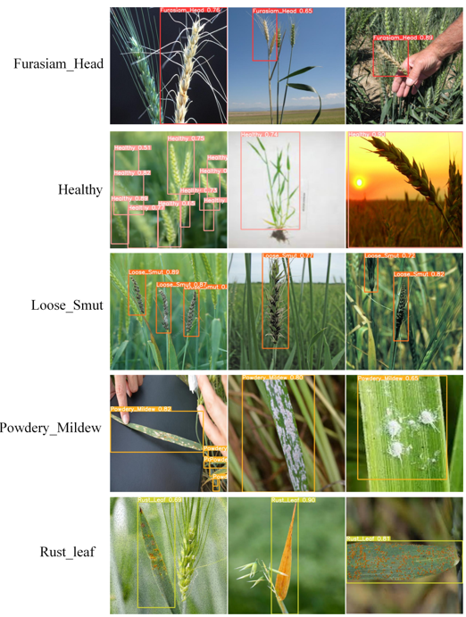
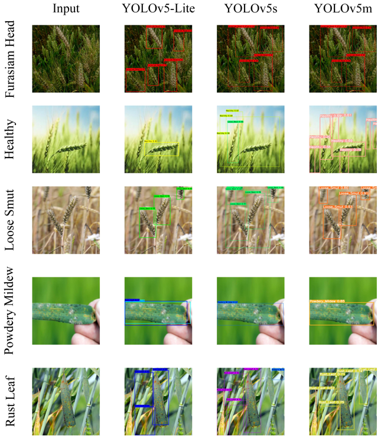
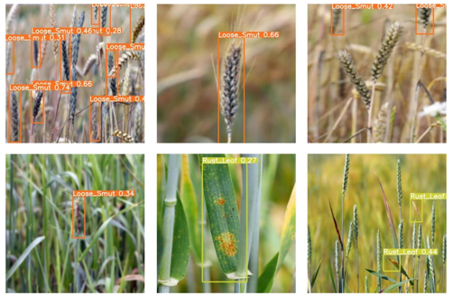
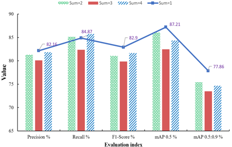
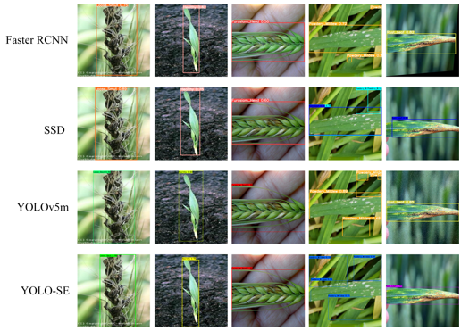

# Research on Wheat Disease Detection Method Based on Deep Learning

---

## 📄 Abstract

A detailed abstract of this research is provided in [Abstract.pdf](./Abstract.pdf).

---

**Author:** Saddam Hussain  
**Supervisor:** Professor Yang Baohua  
**Year:** 2023

---

## 🖼️ Highlights & Results

Below are selected visual results from the experiments:

**YOLOv5-SE Detection Example:**  

**YOLOv5 Detection Example:**  

**YOLOv5 with ShuffleNet Backbone:**  

**Ablation Study Results:**  

**Accuracy/Models Comparison:**  

---

**Read the Abstract:**  
Open [Abstract.pdf](./Abstract.pdf) to learn about the motivation, methods, and main findings.

---

## 🛠️ Technologies Used

- **YOLOv5**: State-of-the-art object detection
- **ShuffleNetv2**: Efficient backbone for feature extraction
- **Squeeze-and-Excitation (SE)**: Channel attention module

---

## 📊 Main Results

- **YOLOv5m-SE** achieved the highest accuracy for wheat disease detection.
- See the visualizations above for performance comparisons and sample detections.

---

## 📃 License

This repository is licensed under the [MIT License](./LICENSE).

---

> _“Advancing smart agriculture through deep learning-based plant disease detection.”_
